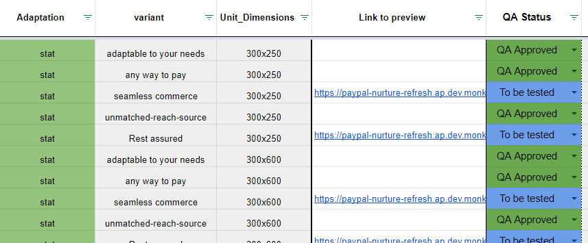

# .richmediarc features.

So .richmediarc has a few features that are quite handy.

So lets list them all

 - [file paths are always relative](#file-paths-are-always-relative).
 - [content node](content-node). Everything in this node will be added and parsed by webpack.
 - [css vars](#css-vars). Everything you put in the `.richmediarc` is accessible in css.
 - [inheritance](#inheritance). `.richmediarc` can inherit from other .richmediarc files.
 - [feeds](#feeds)

## file paths are always relative.
File paths defined in the .richmediarc are ALWAYS relative to the .richmediarc it self.

## content node

So everything in this node will be added and parsed by webpack. So lets look at how a default .richmediarc looks like.

```json
{
  "settings": {
    "entry": {
      "js": "./script/main.js", // required: points to the starting js file.
      "html": "./index.html" // required: points to the main html file.
    },
    "size": {
      "width": 300, // required: width of richmedia unit
      "height": 600 // required: height of richmedia unit
    }
  },
  "content": {  // not required: can put anything in here.
    "bgcolor": "#FF0000", 
    "logo": "./img/logo.png" // not required: will be picked up by webpack and png minified.
  }
}
```

So if you want to load this file later you can do this like this.

```es6
// you load the config like this. Why? because when accessing the config like this you 
// will get the parsed version of the config and not just the json file. 
import config from "richmediaconfig";

img.src = config.content.logo;
img.onload = () => {
    document.body.appendChild(img);
}
```

Why like this? `img.src = config.content.logo;` and not like `img.src = "./img/logo.png"` this is because the browser 
will not be able to find ./img/logo.png.

## css vars
Everything you put in the `.richmediarc` is accessible in css.

So the rich-media-temple-server (webpack) will add all the data from the config to the css through css vars.

How would you access them? Well like this.

```css

body {
  background-color: var(--content-bgcolor);
  margin: 0;
  padding: 0;
  width: 100%;
  height: 100%;
}

.banner {
    width: var(--settings-size-width);
    height: var(--settings-size-height);
}

.logo {
  background: url(var(--content-logo));
  margin: 0;
  padding: 0;
  width: 100px;
  height: 100px;
}
```

## inheritance 

So when doing big projects you will encounter duplication in your .richmediarc files. You can reduce or even eliminate 
this by inheriting from other config files. You can do this by using the parent node. See the Example.

```json
{
  "parent": "../parent.richmediarc",
  "settings": {
    "entry": {
      "js": "./script/main.js", // required: points to the starting js file.
      "html": "./index.html" // required: points to the main html file.
    }
  }
}
```

lets look at `../parent.richmediarc`

```
{
    "settings":{
        "size": {
          "width": 300, 
          "height": 600
        }
    },

    "content":{
       "bgcolor": "#FF0000", 
       "logo": "./banner/img/logo.png" // all paths are relative the .richmediarc file.
    }
}
```

size is required by the .richmediarc but because its inheriting from a parent one you only have to define it 
once, same goes for the content.

## feeds
You are able to link to a google spreadsheet so you can build multiple units with one code base and one .richmediarc.

```
{
  "settings": {
    "entry": {
      "js": "./script/main.js", // required: points to the starting js file.
      "html": "./index.html" // required: points to the main html file.
    },
    "size": {
      "width": 300, // required: width of richmedia unit
      "height": 600 // required: height of richmedia unit
    },
    "contentSource":{
      "url":"https://docs.google.com/spreadsheets/d/1cWkhMxC01WVFqWR616DyN7OPvtatD-ivguK9OSs_msg/edit?usp=sharing",
      "apiKey": "API_KEY_PLACEHOLDER"
    }
  },
  "content": {
    "copy1": "This is the first copy",
    "copy2": "This is the second copy",
    "bgcolor": "#FF0000", 
    "logo": "./img/logo.png"
  }
}
```



column 1 | column 2
--- | ---
something | and you


First Header | Second Header 
--- | ---
Content from cell 1 | Content from cell 2
Content in the first column | Content in the second column

When you replaced API_KEY_PLACEHOLDER with your own api key https://developers.google.com/sheets/api/guides/authorizing#APIKey

